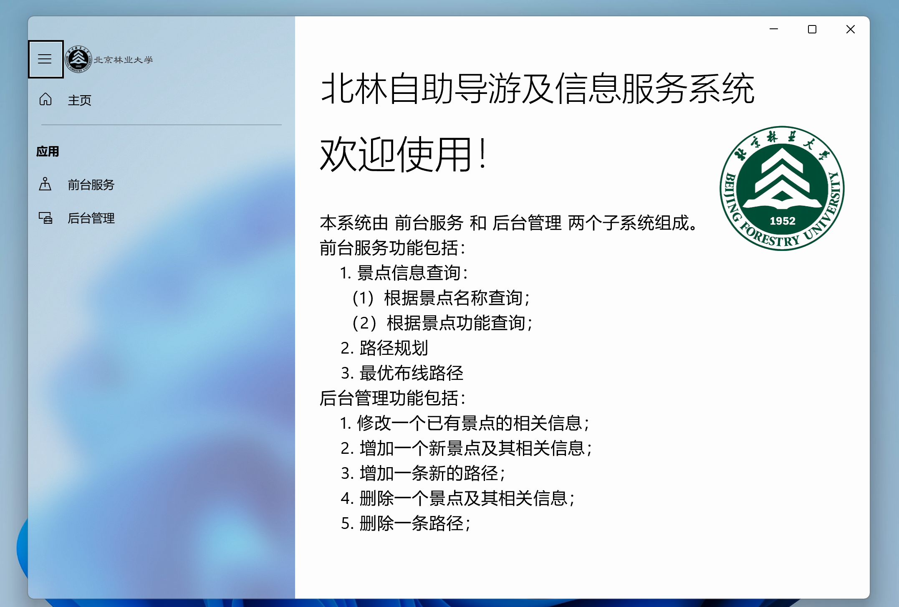
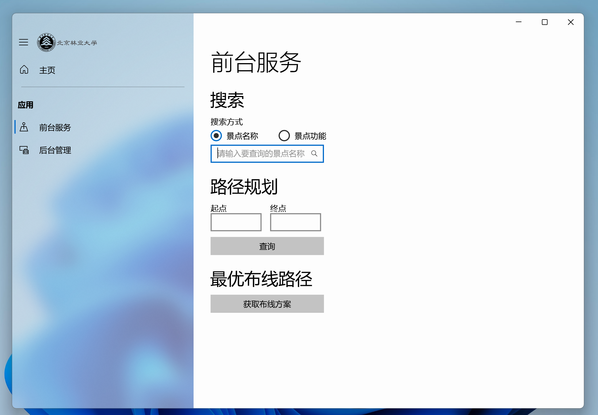
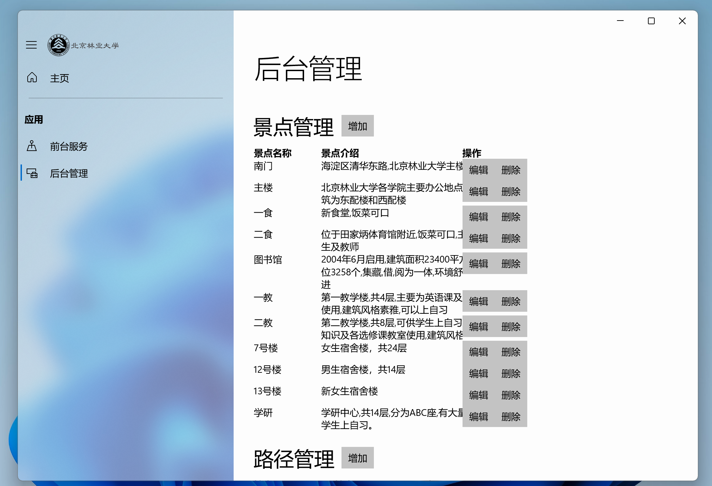

# 北京林业大学旅游信息管理系统

* 项目简介

  本项目为北京林业大学2017级 数据结构课程设计，为通用Windows应用程序（UWP）主要开发语言为C++/CX，开发时间一周。**本软件仅供学习交流**

* 现存问题

  * 暂时无法异步弹出登录框，登录验证存在问题
  * 由于时间问题，用户管理功能已实现接口，但未开发用户界面
  * 根据题目要求，数据存储在txt文件中，未对接数据库

* 运行截图







* 注意事项

    1. 由于Windows API中的要求 UWP应用只能读取固定区域的文件，具体的AppData文件目录无法确定。初次使用为了数据库的正常读取，请使用`\Util`文件夹下`UWPHelper.cpp`中的`getFilePath()`函数获取`AppData`目录，然后将`\DataBase\map.txt`及`\DataBase\map.txt`拷贝到相应目录下。以后不需再次配置。函数原型：

       ```c++
       static const std::wstring getFilePath(const std::string & input) {
           // Get the app's installation folder
        StorageFolder^ appFolder = ApplicationData::Current->LocalFolder;
        String^ path = appFolder->Path + "\\" +std_str_To_Platform_Str(input);
        // Get the app's manifest file from the current folder
        return path->Data();
       }
       ```

    2. 后台管理默认用户
       * 用户名：admin
       * 密码：admin
    > 您可以使用\Service\UserService中的createUser()方法创建新用户

* 参考资料

  * 数据结构（C++语言版）（第2版）邓俊辉 清华大学出版社
